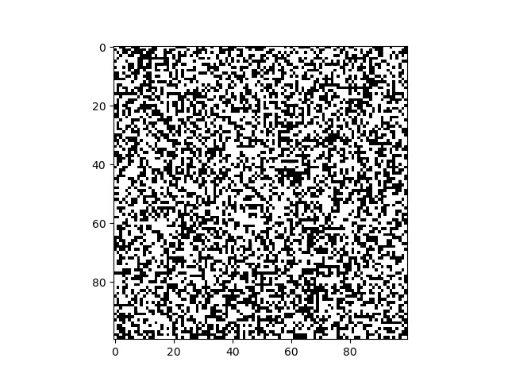

# Hopfield_Network_BIO210
This public version does not provide the code as it is a reccurent course project given at EPFL.
Hopfield's Network.



The Hopfield network is a computational model for associative memory, proposed by John Hopfield in 1982. It models a simple mechanism to explain how a neural network could store representations (i.e. the neural activity corresponding to a certain concept) in the form of weighted connections between neurons.
In this project you will implement the iterative process which allows to retrieve one of the stored (memorized) patterns starting from the representation of a new (unseen) pattern.

## The code

All functions necessary to the simulation of the Hopfield Network are coded inside functions.py, while main.py is a file to be run as a script. Please read carefully the docstrings of the functions before usage. The data types for the arguments are specified in the Parameters section, and it is crucial to follow those indications.

In addition to the functional approach, we also have an object-oriented programming (OOP) implementation in the file mainOOP.py. The classes used in this implementation include HopfieldNetwork.py, DataSaver.py, Patterns.py and Checkerboard.py.

## The common usage

The Hopfield network can be trained to memorize patterns. One can then try to retrieve one of these patterns from a perturbed version of it. This is why we coded functions capable of generating patterns, memorizing them using a weights matrix, perturbing a pattern, and retrieving them.

### Understanding the process

In `main.py` we go through the whole process, printing out each step of it, so that the user can understand all the steps of the code. The iterative process usually converges to one of the memorized patterns and we can see which one it is.

### The evolution towards the original state in terms of energy

We can measure how closely a given pattern matches the patterns stored in the network by using the weights matrix. For any input pattern, we calculate its energy, which reflects its "proximity" or "similarity" to the stored patterns. When a perturbed pattern is updated by the network, it evolves towards its original form by moving to a lower energy state, seeking an energy minimum.

### Testing and profiling

We made a series of unit tests. In `functions_test.py` you can see all the tests you can run them from the command line using the command ` pytest .\functions_test.py `in the terminal.

by using the command `pytest` in the terminal this will run every test made.

For profilling, run the file `profilling.py` to see the time of execution of the functions. You can use it on The `main.py` by entering 1 when running the code or running the personnalized profilling test we made by entering 2 when running the code.

## Installation and Setup

You can choose one of the two following methods to install and setup the project :

### 1. Setup the conda environment using the Hopfield_env.yml file

```
conda env create -f Hopfield_env.yml
conda activate env_
```

This method is complete and makes sure all packages that were present during development are installed in the environment. For more info, visit : https://conda.io/projects/conda/en/latest/user-guide/tasks/manage-environments.html#creating-an-environment-from-an-environment-yml-file

### 2. Setup the conda environment from scratch

#### Step 1: Install Conda

If you haven't installed Conda yet, download and install Miniconda or Anaconda following the instructions on the website.

#### Step 2: Create a New Conda Environment

Open your terminal (or Anaconda Prompt on Windows) and run the following command to create a new Conda environment for your project:

```
 conda create -n hopfield_project python=3.12.6
```

This command will create a new environment named hopfield_project with Python 3.12.6. You can adjust the Python version as needed.

#### Step 3: Activate the Environment

Activate the environment by running:

```
conda activate hopfield_project
```

You should see (hopfield_project) appear before your terminal prompt, indicating the environment is active.

#### Step 4: Install Required Packages

With the environment active, install the required packages (numpy, matplotlib, pytest, git, coverage, pandas, pytables and ffmpeg):

```
conda install numpy matplotlib pytest git coverage pytest-benchmark pandas
```

for ffmpeg to get .mp4 files,and for pytables, use this command in the terminal:

```
conda install conda-forge::ffmpeg
conda install conda-forge::pytables
```

These packages should now be available in your environment.

#### Step 5: Verify Installation

To confirm that everything is installed correctly, you can list the packages in the environment:

```
conda list
```

You can also test each package by opening a Python shell and trying to import them:

```
import numpy
import matplotlib
import pytest
import coverage
import pandas
```

#### Step 6: Deactivate the Environment

When you're done working, you can deactivate the environment by running:

```
conda deactivate
```

## Results of the Experiments

You can access the detailed results of the experiments [here](./datas).
A summary resuming all the experiments done is available [here](https://github.com/EPFL-BIO-210/BIO-210-24-team-38/blob/main/summary.md).

## Credits

This project is realised by Three students in their second year at EFPL in the Life-Science section as part of the course
"Applied software engineering for life sciences" given by the teacher Alexander Mathis.
We were the group 38 and our teacher assistant was Wesley Elliott Stephen Monteith-Finas.

- Adrien Marie Saouma *([Adrien's GitHub account](https://github.com/saoumadr))*
- Hamza Bennani *([Hamza's GitHub account](https://github.com/Hamzakuma))*
- Gabriel Takuma Esmiol *([Gabriel's GitHub account](https://github.com/Gabriel-Esmiol))*
