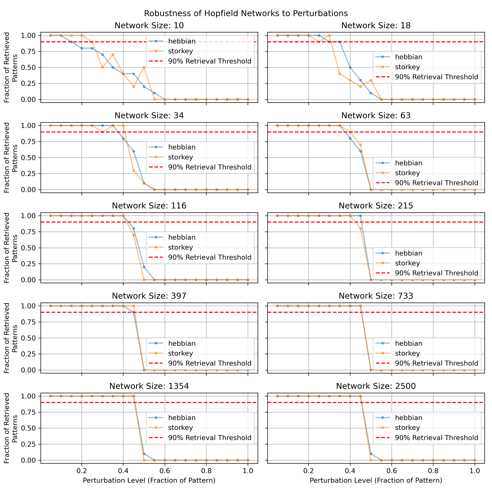
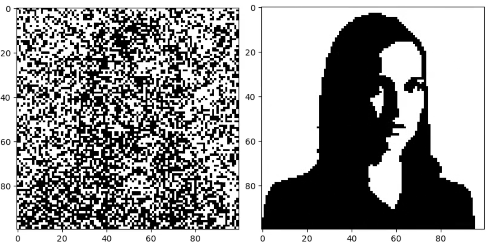
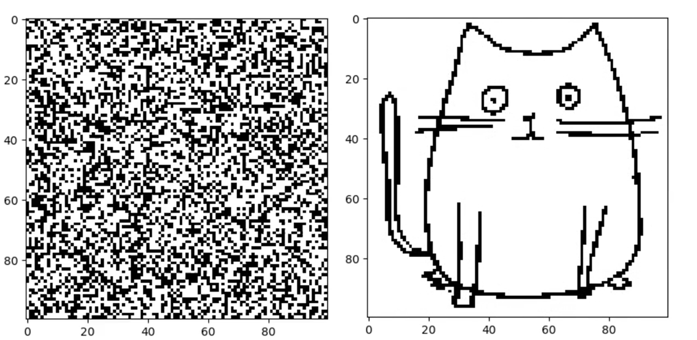
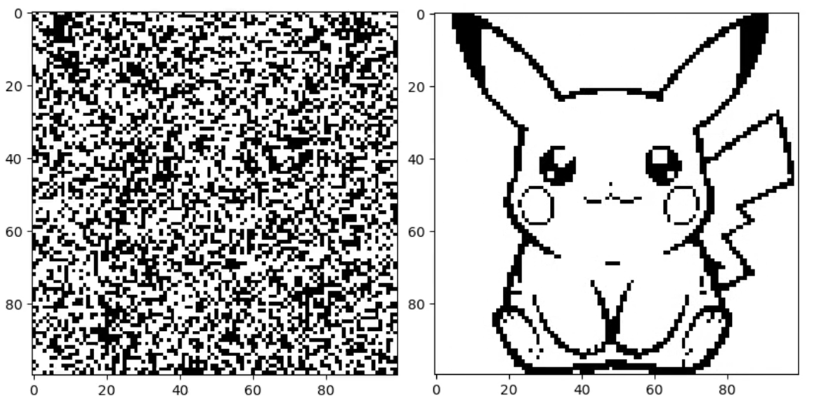
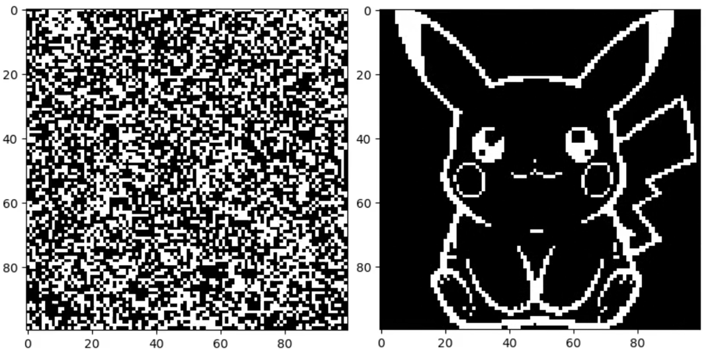

# Project Overview

This project explores the functionality and performance of Hopfield networks through a series of controlled experiments. The primary objective is to assess the network's ability to accurately retrieve stored patterns that got perturbed. By simulating diverse scenarios and analyzing the results, we aim to understand the factors that influence the network's success.

## Experiments

The experiments were designed to evaluate the retrieval success rate of the network as a function of critical variables. Success probability was determined by running multiple retrieval simulations for specific parameter configurations and calculating the average outcome. Below is a summary of the experiments:

1. **Effect of Pattern Size and Perturbations**  
   We examined how the size of the stored patterns and the level of noise (percentage of perturbations) in the input influence the network's ability to retrieve the correct pattern.

2. **Impact of Noise on Retrieval Success**  
   This experiment explored how varying levels of noise affect the threshold at which retrieval becomes unreliable.

3. **Application: Image Retrieval**  
   To demonstrate a practical application, we binarized images and tested the network's ability to retrieve it. This experiment highlights the potential of the Hopfield networks for image recognition and storage.

## Results

In this section, we present the outcomes of our experiments, along with visualizations to illustrate key findings. Each plot highlights the relationship between important parameters and the retrieval success rate, providing insights into the network's performance and limitations.

## 1. Capacity

### Estimation of Storage Capacity

This experiment aims to empirically estimate the storage capacity of the Hopfield network trained with both the Hebbian and Storkey rules, simulated using the synchronous update rule.

### Specific Settings

Network sizes: 10 networks ranging logarithmically from 10 to 2500 neurons:
sizes = [10, 18, 34, 63, 116, 215, 397, 733, 1354, 2500].

Number of patterns (t): Random base patterns are sampled around the theoretical estimate of the network capacity

Perturbations: Apply a perturbation by changing 20% of the values in each base pattern.

Trials per configuration: 10 trials are run for each network size and learning rule.

If you want to make another set of datas you can change settings in Experiment.py and decomeante lignes 75 to 95. It will take a lot of time.

### Results

### Capacity Curves for Hebbian Rule

### Capacity Curves for Storkey Rule

### Empirical vs. Theoretical Capacity

### Capacity Curves Analysis
#### Hebbian Rule
The first plot illustrates the fraction of retrieved patterns vs. the number of patterns for networks trained using the Hebbian rule across different network sizes.

Observations:

As the number of neurons increases, the capacity (number of patterns retrieved with ≥90% probability) grows but at a slower rate compared to the Storkey rule.
The retrieval performance for smaller networks drops sharply as the number of stored patterns approaches the theoretical capacity limit.

#### Storkey Rule
The second plot shows the fraction of retrieved patterns vs. the number of patterns for networks trained using the Storkey rule.

Observations:

The Storkey rule demonstrates significantly higher capacity compared to the Hebbian rule for the same network sizes.
Larger networks maintain successful retrieval for a higher number of patterns, consistent with theoretical predictions.

### Empirical vs. Theoretical Capacity
The final plot compares empirical capacities (retrieved patterns with ≥90% probability) with theoretical estimates for both Hebbian and Storkey rules.

Observations:

Empirical results align well with theoretical estimates, confirming the asymptotic bounds:
 
The Storkey rule outperforms the Hebbian rule for all network sizes, showcasing higher pattern storage capacity.

### Conclusion
- The Storkey rule consistently achieves higher storage capacity compared to the Hebbian rule.
- Empirical results align closely with theoretical estimates, validating the asymptotic bounds for both learning rules.
- Larger networks demonstrate improved retrieval capabilities, as expected from theoretical models.

## 2. Robustness

### Robustness Analysis

For this experiment, we fixed the number of stored patterns to 2.

### Defining Robustness

The robustness of the network is defined as the maximum percentage of perturbations such that the success probability remains above an acceptable threshold. To determine this, we ran experiments for various network sizes while progressively increasing the percentage of perturbations.

### Data Access

- **Pandas DataFrames**: Detailed results for each experiment are available in the following folder:  
  [pandas_results](./datas/robustness_res/pandas_res)
- **Tables**: A summary of the data used to generate the plots can be found here:  
  [table_of_robustness](./datas/robustness_res/Robustness_table.md)

### Robustness Results

Below is a visualization comparing Hebbian and Storkey learning rules across different network sizes. The x-axis represents the percentage of perturbations,and the y-axis represent the fraction of retrieved pattern.

> These plots can be reproduced by running the script: `robustness.py`.

### Observations and Conclusions

1. **Comparison of Learning Rules**:  
   - The results are largely similar for both Hebbian and Storkey rules. Regardless of the rule or network size, the robustness to perturbations only reaches approximately 50% before the success probability drops significantly.  
   - This suggests that the choice of learning rule does not significantly impact robustness for the retrieval task when 2 patterns are stored.

2. **Impact of Network Size**:  
   - For larger networks, the robustness curves appear smoother. This is consistent with observations from previous experiments and reflects improved stability as network size increases.

3. **Dependence on Stored Patterns**:  
   - While the robustness was similar for both learning rules, it is important to note that the number of patterns stored can influence this behavior. In this experiment, we fixed the number of stored patterns to 2, which may affect the generalizability of the results.

4. **Practical Implications**:  
   - The succesful retrieval can be achieved for patterns perturbed by less than 50%.
   - For large network sizes, both learning rules perform similarly, which simplifies the choice between them for applications focused on robustness. Nonetheless, below 215 neurons, the best of the two learning rules varies.

This analysis highlights that robustness to perturbation is independent of the learning rule but highly influenced by the number of patterns stored and the size of the network.

## 3. Image Retrieval

This section focuses on the retrieval of images from 40% (or less) perturbed original images.

**Images**:  
On the left, the 40% perturbed images and on the right the retrieved ones.

Image of Nathalie Portman:

 
 
Image of a drawn cat:

 
 
Image of Pikachu

**Inversions**

When one perturbs a pattern at more than 50% (here 60%), the network converges to the inverse of the original image.

Image of the inverted pikachu:

**Animations**:  
In these animations, one can see the steps of the images' reconstructions done by the program using the asynchronous update rule and the hebbian learning rule.

- [Nathalie Portman](https://github.com/EPFL-BIO-210/BIO-210-24-team-38/blob/main/datas/animations/anim_portman.mp4)
 

- [Cat drawing](https://github.com/EPFL-BIO-210/BIO-210-24-team-38/blob/main/datas/animations/anim_cat.mp4)
 

- [Pikachu](https://github.com/EPFL-BIO-210/BIO-210-24-team-38/blob/main/datas/animations/anim_pikachu.mp4)

> These plots can be reproduced by running the script: `retrieve_img.py`.

## Conclusion

